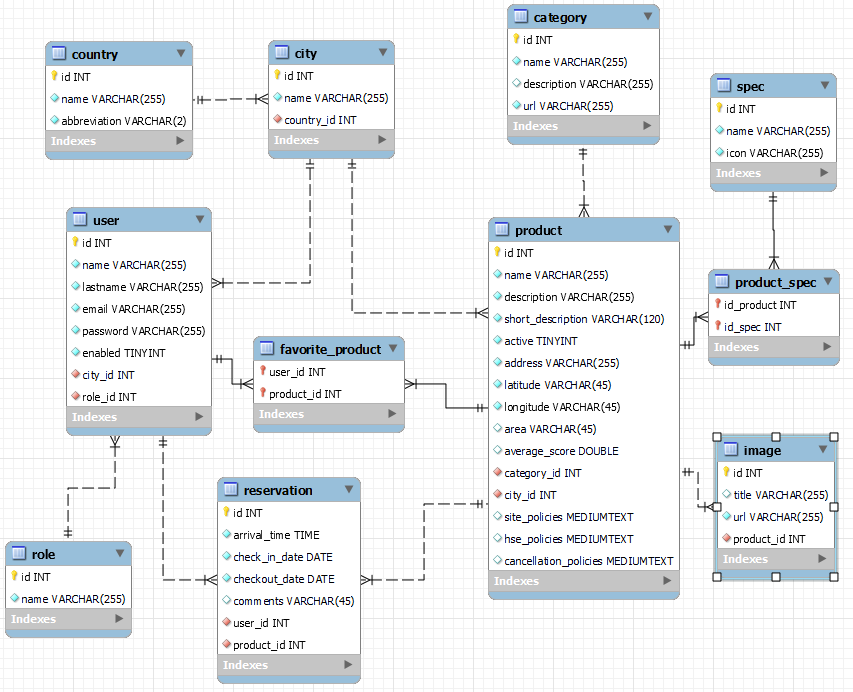

## Proyecto Integrador DigitalBooking

Deploy: http://0521ptc2n2-grupo9-airc2cfronts3.s3-website.us-east-2.amazonaws.com/ <br/>
Deploy2: http://airc2c.com/

---

- **Nombre del proyecto:** **_Digital Booking - Airc2c_**
- **Resumen general del proyecto:** El proyecto consiste en el desarrollo de una aplicación completa para servicios de hospedaje, aplicando los conocimientos adquiridos durante la primera etapa de la carrera. En él, se pueden buscar y reservar diferentes tipos de alojamientos, y se pueden crear nuevos a través del panel de administración. La página permite tres flujos de navegación, ya sea como usuario no registrado, usuario registrado o administrador. Para realizar una reserva, se debe estar registrado e iniciar sesión. Se encuentran implementados filtros para buscar alojamientos por ciudad y/o rango de fechas, como así también por categoría. La realización de este proyecto simula un entorno de trabajo real donde se utilizan metodologías ágiles y se deben cumplir los plazos acordados para los sprints.

## Equipo

- **Giovanny Cárdenas**

- **Martha de La Ossa**

- **Henry Gutierrez Foronda**

- **Cristian Diaz**

- **Virginia Sofía Iójimo**

- **Carlos Ignacio Justel**<br>
  En el proyecto integrador me desempeñé principalmente en el área de Frontend utilizando React, generando una web responsive dando estilos con CSS. Colaboré en gran parte del Backend utilizando tecnologías como Spring Boot, Spring Security con JWT, Hibernate, Swagger para documentar, entre otras. Realicé pruebas sencillas con Postman para corroborar endpoints de la API y contribuí en ciertas relaciones de la base de datos con MySQL.

## Tecnologías utilizadas

**Desarrollo del proyecto:**

- IDEs: IntelliJ IDEA Community, Visual Studio Code.
- Sistemas de control de versiones: Git (GitLab)
- Simulación / Virtualización: Cuenta en Amazon Web Service (AWS).

**Tecnologías utilizadas para el desarrollo:**

- **Front end**

  - React
    - react-router-dom (manejo de rutas)
    - react-datepicker (calendario)
    - react-image-gallery (galeria)
    - react-fontawesome (íconos)
  - CSS

- **Back end**

  - Java
    - Spring
    - Spring Boot
    - Spring Security
    - API Rest
  - JWT
  - Maven
  - Swagger (documentación)

- **Base de datos**

  - MySQL

- **Infraestructura**

  - AWS
    - Deploy en AWS utilizando pipelines desde GitLab CI/CD
    - Servicio RDS para alojar la base de datos MySQL
    - Amazon Elastic Compute Cloud (EC2) para alojar el backend (API)
    - Dos buckets S3 (Amazon Simple Storage Service). Uno para las imágenes y otro para el front end.

- **Testing**
  - Pruebas de caja negra y caja blanca, test unitarios.
  - Selenium
  - Postman

## Documentación técnica del proyecto

### **Ambiente de desarrollo**

**Instrucciones para armar el ambiente de desarrollo**

- Instalar los IDEs IntelliJ IDEA y Visual Studio Code.
- Instalar MySQL Workbench
- Instalar Postman

- Clonar el repositorio
- Abrir la carpeta 'digitalbooking' del proyecto backend en IntelliJ y el frontend en Visual Studio Code.

**Base de datos:**

- Una vez abierto MySQL Workbench crear una nueva conexión o utilizar una ya existente.
- Desde el apartado File seleccionar “Run SQL Script” u “Open SQL Script” y correr el script que creara el schema con el nombre db_digitalbooking y sus tablas y relaciones correspondientes. (schema_db_digitalbooking.sql). Los scripts se encuentran dentro de la carpeta 'backend'.
- Posteriormente abrir y correr el script de inserción de datos (insert_db_digitalbooking.sql).

  - Script schema: schema_db_digitalbooking.sql
  - Script inserts: insert_db_digitalbooking.sql

- Estructura y diagrama<br>



**Frontend:**

1. Desde Visual Studio Code, abriremos la terminal dentro de la carpeta de frontend.

2. Posicionado dentro la carpeta 'frontend', usar npm i para instalar las dependencias necesarias.

```
$ npm install
```

3. Una vez completo el paso anterior, ejecutar el siguiente codigo en la consola:

```
$ npm start
```

- Esto nos iniciará el proyecto por default en localhost con el puerto 3000. http://localhost:3000

**Backend:**

- En el archivo de application.properties debemos colocar los datos de nuestra base de datos (MySQL Workbrench) local. Es decir, el username y password.
- Posteriormente ejecutar con el botón de RUN el proyecto backend desde el IntelliJ.
- Para probar los distintos endpoints podemos utilizar Postman importando la siguiente colección: PI_DigitalBooking.postman_collection.json que se encuentra dentro de la carpeta de Testing. Se recomienda crear variables de entorno (environments) con el nombre 'url' para http://localhost:8080 y 'token' para poner poner el token que devuelva el endpoint /authenticate, ya que así se encuentran definidos.

**Infraestructura**

- Estructura y diagramas


**Testing**

- Informe Final de testing
- Pruebas de caja negra y caja blanca
- Prueba automatizadas en Selenium Web Driver
- Pruebas automatizadas en Postman para el consumo a la API
